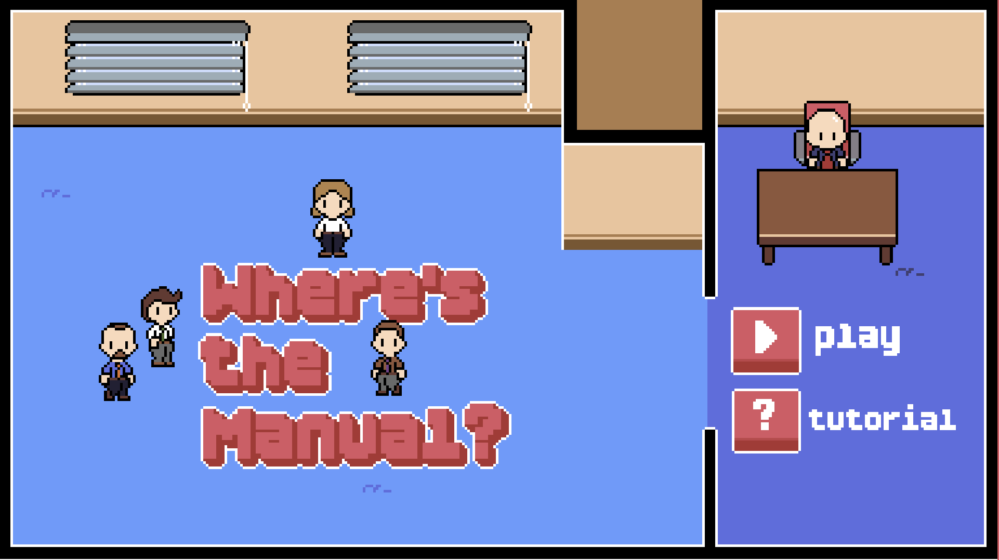
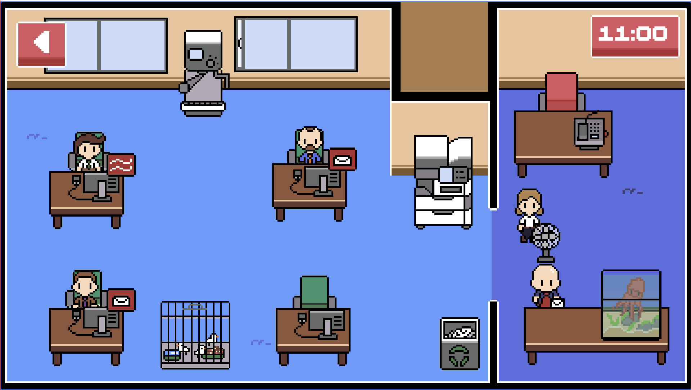
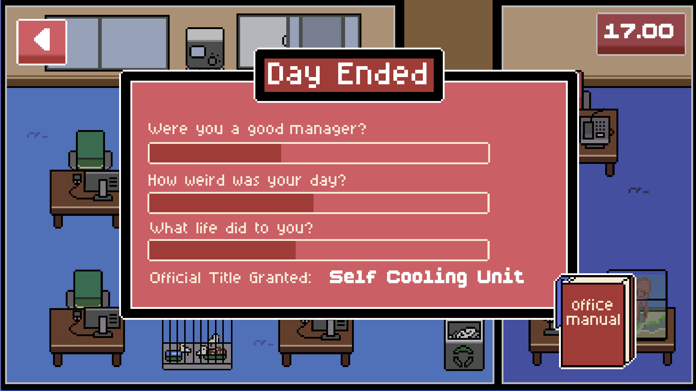
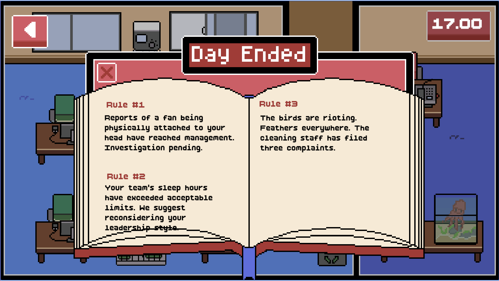

# Where's the Manual?

A 2D top-down office simulation game built in Unity and C#, with absurdist humor. Employees run their own tasks, queue up for shared stations, and get judged at the end of each day.

**[Play it on itch.io](https://xxaerynn.itch.io/wheres-the-manual)**

## Features

- **Employees run their own tasks** : mail, printer, overheat breaks — using a coroutine-based task system, with a `needsHelp` flag so tasks don't conflict with each other.
- **Queue system** : built around an `IWorkStation` interface, so any station (printer, boss's chair, etc.) can use the same waiting-in-line logic.
- **A\* pathfinding on a hex grid** : I moved this from a square grid to a hexagonal one to make movement look more natural, with the grid updating dynamically through the manager.
- **Item carrying** : an enum-based (Hand/Head) system, with sorting order handled so carried items render correctly on top of the character.
- **Printer & ink mechanic** : employees queue at the printer, react when it runs out of ink, and wait until it's working again.
- **End-of-day nicknames & rulebook** : tracks 10 stats across 3 groups (duty/absurdity/suffering), then picks a nickname and a rulebook line for each employee based on their highest stats. This is where most of the game's humor comes from.
- **Day cycle, main menu, settings** : scene navigation between menus and the office, driven by a day/clock system.
- **WebGL build** : playable in-browser on itch.io.

## Development Notes

Built solo over about 3.5 months (May–July). 
Started as a basic interaction system and grew into a full employee simulation. A few things got rebuilt along the way instead of just staying feature additions : e.g. pathfinding moved from a square to a hexagonal grid.
Still on the list: an in-game tutorial and a few more mechanics I originally planned for a bigger scope.

## Tools Used
Unity 6, C#, Aseprite (all visuals made by me)

## Screenshots

